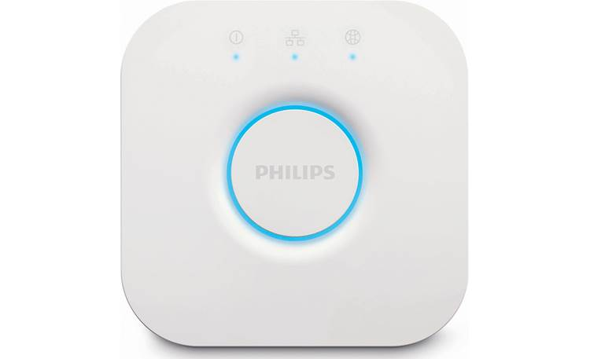
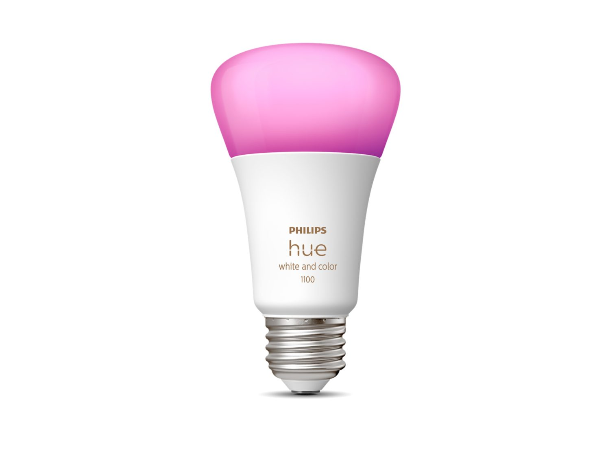
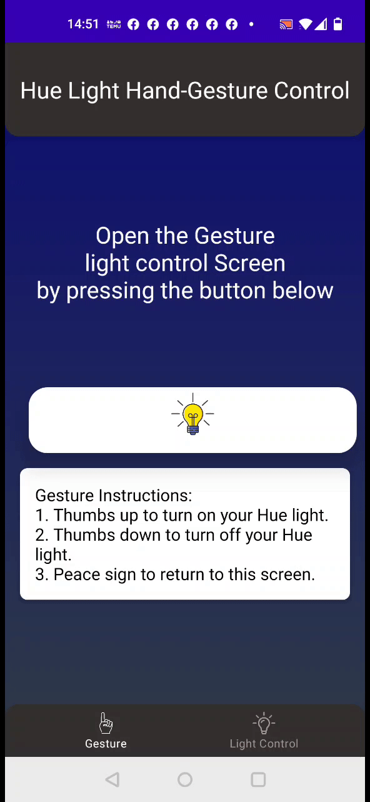

# MediaPipe and Phillips Hue Gesture Recognizer Android Demo 💡

### Overview

This is a camera app that can either continuously detects hand landmarks and classifies gestures (gesture name and confidence level) and can interact with Phillips Hue smart lights.

This application should be run on a physical Android device to take advantage of the camera.

## Build the demo using Android Studio

### Prerequisites and Changes

*   A physical Android device with a minimum OS version of SDK 24 (Android 7.0 -
    14 (most current) with developer mode enabled. The process of enabling developer mode
    may vary by device.
*   A Phillips Hue bridge and at least one Smart light
*   Android Studio

## Phillips Hue Bridge  

## Phillips Hue Light Bulb used 

### Android App Demo

### Full Setup Demo

### Building

*   Open Android Studio. From the Welcome screen, select Open an existing
    Android Studio project.

*   From the Open File or Project window that appears, navigate to and select
    the mediapipe/examples/gesture_recognizer/android directory. Click OK. You may
    be asked if you trust the project. Select Trust.

*   If it asks you to do a Gradle Sync, click OK.

*   With your Android device connected to your computer and developer mode
    enabled, click on the green Run arrow in Android Studio.

### Models used

Downloading, extraction, and placing the models into the *assets* folder is
managed automatically by the **download.gradle** file.
